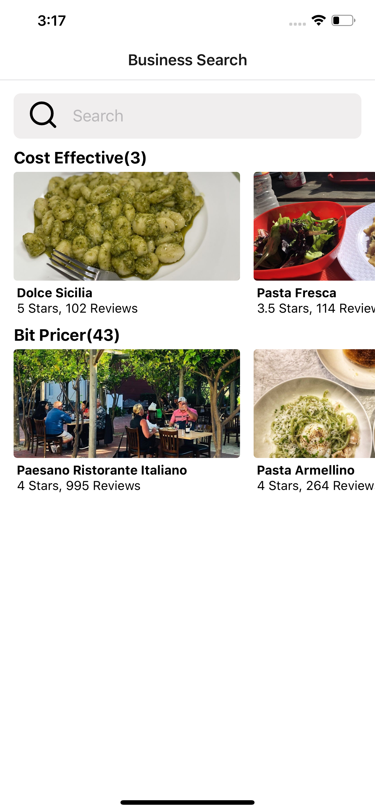
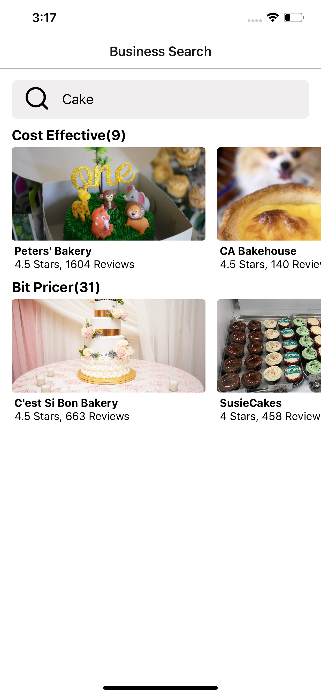
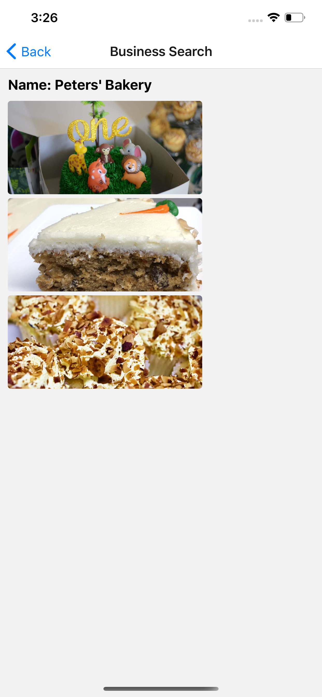

<a href="https://www.linkedin.com/in/milanpanchal/">
    </a>
    
# RestaurantDemo [React Native]
I've built small restaurant demo app in React Native. In this app, I've used Yelp API to fetch data from server using React Native `axios` library and showing into to the list as per following UI.

**You can install axios using following command:**

```$ npm install axios```


## Fetures:

* Default Listing of Restaurants
* Search Restaurants
* Navigate to Detail Screen, to view more images from the Restaurants
* Error Handling


## Screenshots:






## Credit

[Stephen Grider](https://twitter.com/ste_grider), 

Engineering Architect


## Author

**Milan Panchal**, follow me on:

1. **Twitter** ([@milan_panchal24](https://twitter.com/milan_panchal24))
2. **Github** ([/milanpanchal](https://github.com/milanpanchal/))
3. **Medium** ([https://medium.com/@milanpanchal24](https://medium.com/@milanpanchal24))
4. **LinkedIn** ([/in/milanpanchal/](https://www.linkedin.com/in/milanpanchal/))
2. **LeedCode** ([/milanpanchal](https://leetcode.com/milanpanchal/))
